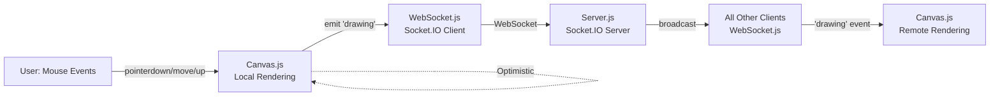

## Collaborative Canvas — Architecture Documentation

This document explains how our real-time collaborative drawing application works. We'll cover how drawing events flow from your mouse to everyone else's screen, the messages we send over WebSockets, how undo/redo works globally, the performance choices we made, and how we handle multiple people drawing simultaneously.

If you're maintaining or extending this app, this guide gives you the essential patterns and design decisions we actually implemented.

---

## What We Built (Quick Overview)

**Core Technology Stack:**
- **Server:** Node.js + Express + Socket.IO (WebSocket wrapper)
- **Client:** Vanilla JavaScript with HTML5 Canvas
- **Communication:** Socket.IO real-time bidirectional events
- **Architecture Pattern:** Broadcast-based synchronization with server-side history storage

**Key Features:**
- Real-time collaborative drawing with instant local feedback
- Multi-user cursor tracking with color-coded indicators
- Global undo/redo that works for all connected users
- Automatic reconnection with full drawing history replay
- User presence list showing who's currently online

---

## 1 — Data Flow (How Drawing Events Travel)

Here's the journey of a single brush stroke from your mouse to everyone else's canvas:



**Step-by-step breakdown:**

1. **User interaction:** You click and drag on the canvas. JavaScript captures `mousedown`, `mousemove`, and `mouseup` events.

2. **Immediate local rendering:** `canvas.js` draws the stroke on your screen instantly (optimistic rendering). You see your drawing with zero delay.

3. **Send segments to server:** For each `mousemove`, we calculate the line segment (from previous point to current point) and emit it through Socket.IO as a `drawing` event with coordinates, color, and brush size.

4. **Server broadcasts:** `server.js` receives the drawing event and immediately broadcasts it to all other connected clients (not back to you — you already drew it).

5. **Other clients render:** Each remote client receives the `drawing` event and renders that exact line segment on their canvas.

6. **Stroke completion:** On `mouseup`, we emit `stopDrawing` and the server saves the complete stroke to `drawingHistory` (an array of all strokes).

**Why this feels fast:** Your client doesn't wait for server confirmation. You draw locally first, then sync happens in the background.

---

## 2 — WebSocket Protocol (What Messages We Send)

We use **Socket.IO** (not raw WebSockets) for simplicity and built-in reconnection. All messages are JSON events.

### Client → Server Events

| Event | Payload | Purpose |
|-------|---------|---------|
| `registerUser` | `username` (string) | Tell server your username; get assigned a color |
| `requestHistory` | (none) | Ask for full drawing history (used on reconnect) |
| `startStroke` | `{ color, lineWidth }` | Signal beginning of a new stroke |
| `drawing` | `{ x0, y0, x1, y1, color, lineWidth }` | Send a line segment while drawing |
| `stopDrawing` | (none) | Signal end of current stroke; server saves it |
| `cursorMove` | `{ x, y }` | Stream cursor position for real-time tracking |
| `undo` | (none) | Request to undo last stroke globally |
| `redo` | (none) | Request to redo previously undone stroke |

### Server → Client Events

| Event | Payload | Purpose |
|-------|---------|---------|
| `initialHistory` | `[strokes array]` | Send full drawing history to newly connected client |
| `drawing` | `{ x0, y0, x1, y1, color, lineWidth }` | Broadcast someone else's line segment |
| `stopDrawing` | (none) | Someone finished their stroke |
| `redrawAll` | `[strokes array]` | Full history after undo/redo (everyone redraws) |
| `remoteCursor` | `{ id, x, y, color, username }` | Another user's cursor position |
| `updateUserList` | `[users array]` | Current list of online users |
| `userDisconnected` | `{ id }` | Someone left; remove their cursor |

### Example: Drawing a Line Segment

**Client sends:**
```javascript
socket.emit('drawing', {
  x0: 100, y0: 150,
  x1: 105, y1: 155,
  color: 'black',
  lineWidth: 5
});
```

**Server broadcasts to others:**
```javascript
socket.broadcast.emit('drawing', {
  x0: 100, y0: 150,
  x1: 105, y1: 155,
  color: 'black',
  lineWidth: 5
});
```

**Receiving clients render:**
```javascript
socket.on('drawing', (data) => {
  canvas.renderLine(data.x0, data.y0, data.x1, data.y1, data.color, data.lineWidth);
});
```

---

## 3 — Undo / Redo Strategy (Global Operations)

Our undo/redo is **global** — when anyone hits undo, it affects everyone's canvas the same way.

### How It Works

**Data structures on server:**
```javascript
let drawingHistory = [];  // All strokes in order
let redoHistory = [];     // Strokes that were undone
```

**Undo flow:**
1. Client emits `socket.emit('undo')`
2. Server pops the last stroke from `drawingHistory`
3. Server pushes it to `redoHistory` (so we can redo later)
4. Server emits `redrawAll` with updated `drawingHistory` to **all clients**
5. Every client clears their canvas and redraws all remaining strokes

**Redo flow:**
1. Client emits `socket.emit('redo')`
2. Server pops from `redoHistory` and pushes back to `drawingHistory`
3. Server emits `redrawAll` to all clients
4. Everyone redraws

**Important behavior:**
- Starting a new stroke clears `redoHistory` (you can't redo after drawing something new)
- Undo/redo is **last-in-first-out** (stack-based) — most recent stroke gets undone first
- It's global, not per-user — everyone sees the same undo operation

### Why We Chose This Approach

**Pros:**
- Simple to implement and reason about
- Deterministic — everyone always sees the exact same canvas state
- No complex conflict resolution needed

**Cons:**
- Redrawing the entire canvas on every undo can be slow with thousands of strokes
- No per-user undo (undoing someone else's work might be unexpected)

**Future improvement:** Could implement operation-log pattern with indexed operations and targeted undo (only undo your own strokes).

---

## 4 — Performance Decisions (Why Things Feel Fast)

Here are the key performance trade-offs we made:

###Optimistic Rendering
**What:** Your client draws immediately without waiting for the server.  
**Why:** Eliminates network latency from the user experience. Drawing feels instant even on slower connections.  
**Trade-off:** If the server is slow to broadcast, remote users see your drawing slightly delayed.

###Direct Broadcasting (No Processing)
**What:** Server receives a drawing segment and immediately broadcasts it with `socket.broadcast.emit()`.  
**Why:** Minimal server-side processing keeps latency low.  
**Trade-off:** Server doesn't validate or transform data (clients must trust each other).

### Separate Cursor Channel
**What:** Cursor positions are sent via `cursorMove` events but never persisted to history.  
**Why:** Cursors update constantly (dozens of times per second). Storing them would bloat history.  
**Trade-off:** Cursor positions are lost on reconnect (not a problem since they're ephemeral anyway).

### Full History Replay on Reconnect
**What:** When you disconnect and come back, server sends the entire `drawingHistory` array.  
**Why:** Simple and reliable — you're guaranteed to get the complete, correct state.  
**Trade-off:** Could be slow if there are thousands of strokes (future optimization: send incremental updates or snapshots).

### Socket.IO Auto-Reconnection
**What:** Socket.IO handles reconnection logic automatically with exponential backoff.  
**Why:** We don't have to write custom reconnection code.  
**Trade-off:** Less control over reconnection strategy.

###No Batching (Yet)
**What:** We send every `mousemove` segment individually.  
**Why:** Simpler initial implementation.  
**Trade-off:** High-frequency mouse movements generate lots of small messages. Could batch points into arrays and send every 50ms for better network efficiency.

###No Delta Compression
**What:** Points are sent as absolute coordinates (x, y).  
**Why:** Easier to work with, easier to debug.  
**Trade-off:** Could save bandwidth by sending deltas (differences from previous point).

---

## 5 — Conflict Resolution (Simultaneous Drawing)

### The Good News: Most "Conflicts" Aren't Actually Conflicts

Drawing is **naturally commutative** — when two people draw at the same time, their strokes just layer on top of each other. Order doesn't really matter for visual output.

### How We Handle Simultaneous Drawing

**Scenario 1: Two people drawing different strokes**
- Alice draws a red circle
- Bob draws a blue square at the same time
- Server broadcasts Alice's segments, then Bob's segments (in arrival order)
- Everyone renders in the same order → consistent result
- Visual outcome: both strokes appear, layered on top of each other

**Scenario 2: Undo during active drawing**
- Alice is drawing a stroke (segments still coming in)
- Bob hits undo
- Server pops last *completed* stroke from history
- Alice's in-progress stroke isn't in history yet, so it's unaffected
- Alice finishes her stroke → it gets added to history
- Result: Bob's undo removed the previous stroke, Alice's new stroke appears

**Scenario 3: Simultaneous undo requests**
- Alice and Bob both hit undo at almost the same time
- Server processes them in arrival order
- First undo pops stroke N, second undo pops stroke N-1
- Both undos succeed, two strokes removed
- Everyone redraws twice

### Conflict Resolution Rules

1. **Server ordering is authoritative** — whatever order events arrive at the server is the canonical order.
2. **No client-side conflict resolution** — clients just render what the server tells them.
3. **Global operations are atomic** — undo/redo affects everyone, not just the requester.
4. **Optimistic rendering reconciles implicitly** — your local drawing and the broadcast drawing are visually identical.

### Edge Cases

**Reconnection during active drawing:**
- If you disconnect mid-stroke, your incomplete stroke is lost (never sent `stopDrawing`)
- When you reconnect, you get full history (all *completed* strokes)

**Race condition on undo:**
- If `drawingHistory` is empty and someone hits undo, nothing happens (guard check prevents errors)

**Network lag:**
- If your connection is slow, you might see others' drawings delayed
- But the final result will be correct (you'll catch up)

---

## 6 — Implementation Map

**Server (`server/server.js`):**
- Express HTTP server + Socket.IO
- Stores `drawingHistory` and `redoHistory` in memory
- Handles user registration, assigns random colors
- Broadcasts drawing events to all clients except sender

**Client JavaScript:**
- `canvas.js` — handles mouse events, local rendering, and history replay
- `websocket.js` — Socket.IO client wrapper, manages connection and events
- `cursorManager.js` — tracks and renders remote user cursors
- `userList.js` — displays list of online users
- `main.js` — initializes everything and wires up UI controls

**Client HTML/CSS:**
- `index.html` — canvas element, toolbar, user list
- `style.css` — layout and styling

---

## 7 — Future Improvements

Some ideas we considered but haven't implemented yet:

- **Batched drawing segments:** Collect points and send arrays instead of individual segments
- **Incremental sync:** Send only new strokes since disconnect instead of full history
- **Per-user undo:** Let each user undo only their own strokes
- **Persistent storage:** Save drawing history to a database so it survives server restart
- **Authentication:** Add user accounts instead of just usernames
- **Rooms/channels:** Multiple separate canvases instead of one shared space
- **Vector compression:** Use delta encoding or simplification algorithms

